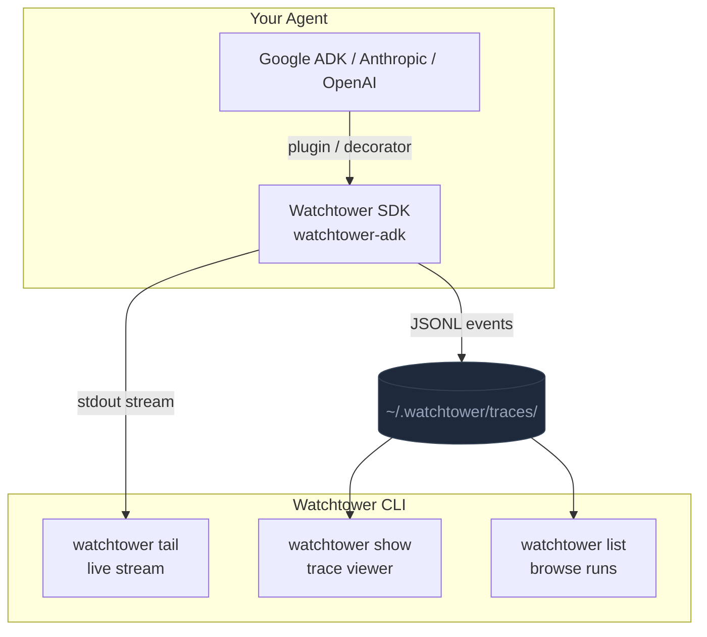

# Watchtower — Terminal observability for AI agents

[](https://github.com/Watchtower-Labs/watchtower-cli/actions)
[](https://www.npmjs.com/package/@watchtower/cli)
[](https://pypi.org/project/watchtower-adk/)
[](https://github.com/Watchtower-Labs/watchtower-cli/blob/main/LICENSE)
[](https://nodejs.org/)
[](https://python.org/)

View traces, tail live events, and debug agent behavior — without leaving your terminal.

> **If Watchtower saves you debugging time, consider [starring the repo](https://github.com/Watchtower-Labs/watchtower-cli) ⭐**

```
┌──────────────────────────────────────────────────────────────────┐
│  watchtower • Run: abc123 • 2024-01-15 14:32:01                  │
├──────────────────────────────────────────────────────────────────┤
│  Duration: 4.2s   LLM Calls: 3   Tool Calls: 5   Tokens: 2,847  │
├──────────────────────────────────────────────────────────────────┤
│  14:32:01.000  ▶  run.start                                      │
│  14:32:01.012  →  llm.request      gemini-2.0-flash              │
│  14:32:01.847  ←  llm.response     1,203 tokens        835ms     │
│  14:32:01.850  ⚙  tool.start       search_web                    │
│  14:32:02.341  ✓  tool.end         search_web          491ms     │
│  14:32:02.345  →  llm.request      gemini-2.0-flash              │
│  14:32:03.201  ←  llm.response     892 tokens          856ms     │
│  14:32:03.205  ■  run.end                                        │
├──────────────────────────────────────────────────────────────────┤
│  [↑↓] Navigate   [Enter] Expand   [/] Search   [q] Quit         │
└──────────────────────────────────────────────────────────────────┘
```

<!-- DEMO GIF: replace with real recording -->

---

## Features

- **Zero-config** — one line of Python, traces start flowing immediately
- **Live tailing** — stream events in real-time as your agent runs (`watchtower tail`)
- **Trace viewer** — navigate past runs with full timeline, search, and bookmarks
- **Local-first** — all data stays on your machine; no accounts, no external services
- **Multi-framework** — Google ADK, Anthropic Claude, OpenAI GPT — same CLI for all
- **Low overhead** — <5% runtime impact on agent execution

---

## Installation

```bash
pip install watchtower-adk        # Python SDK
npm install -g @watchtower/cli    # CLI
```

<details>
<summary>Install from source</summary>

```bash
git clone https://github.com/Watchtower-Labs/watchtower-cli.git
cd watchtower-cli
pnpm install && pnpm build:cli
cd packages/cli && pnpm link --global
```

</details>

---

## Quick Start

### Google ADK

```python
from google.adk.agents import Agent
from google.adk.runners import InMemoryRunner
from watchtower import AgentTracePlugin

agent = Agent(
    name="my_agent",
    model="gemini-2.0-flash",
    instruction="You are a helpful assistant.",
)
plugin = AgentTracePlugin()
runner = InMemoryRunner(agent=agent, plugins=[plugin])
result = runner.run(user_message="Hello!")
```

### Anthropic Claude

```python
from watchtower.sdk import create_for_anthropic

observer = create_for_anthropic(api_key="your-api-key")
response = observer.observe_llm_call([
    {"role": "user", "content": "Hello!"}
])
print(response.content[0].text)
```

### OpenAI GPT

```python
from watchtower.sdk import create_for_openai

observer = create_for_openai(api_key="your-api-key", model="gpt-4o")
response = observer.observe_llm_call([
    {"role": "user", "content": "Hello!"}
])
print(response.choices[0].message.content)
```

### Auto-detection

```python
from watchtower.sdk import Watchtower

# Detects framework from installed packages automatically
observer = Watchtower.create_observer(trace_dir="./traces")
```

Then view the trace:

```bash
watchtower show last
```

---

## Architecture



---

## CLI Commands

### `watchtower show [trace]`

View a saved trace with interactive navigation.

```bash
watchtower show last              # most recent trace
watchtower show abc123            # by run ID
watchtower show 2024-01-15_abc123 # by date + run ID
```

**Keyboard shortcuts:**

| Key | Action |
|-----|--------|
| `↑` / `k` | Navigate up |
| `↓` / `j` | Navigate down |
| `Enter` | Expand event details |
| `Esc` | Back to list |
| `/` | Search |
| `*` | Bookmark |
| `PageUp` / `PageDown` | Page through events |
| `q` | Quit |

### `watchtower list`

Browse recent trace files.

```bash
watchtower list                   # all recent traces
watchtower list --limit 10        # last 10
watchtower list --since 2024-01-15
```

### `watchtower tail <script>`

Run a script and stream events live.

```bash
watchtower tail my_agent.py
watchtower tail --max-events-per-second 200 -- python my_agent.py
```

### `watchtower config`

```bash
watchtower config                          # show current config
watchtower config init                     # create default config file
watchtower config set theme light
watchtower config set timestampFormat absolute
```

---

## Event Types

| Event | Description |
|-------|-------------|
| `run.start` | Agent invocation begins |
| `run.end` | Agent invocation completes |
| `llm.request` | LLM call initiated |
| `llm.response` | LLM response received |
| `tool.start` | Tool execution begins |
| `tool.end` | Tool execution completes |
| `tool.error` | Tool execution failed |
| `state.change` | Agent state modified |
| `agent.transfer` | Multi-agent handoff (ADK) |

---

## Framework Support

| Framework | Status | Multi-agent |
|-----------|--------|-------------|
| [Google ADK](https://google.github.io/adk-docs/) | Production | Full (sequential, parallel, loop, A2A) |
| [Anthropic Claude](https://www.anthropic.com/) | Production | Single-agent |
| [OpenAI GPT](https://openai.com/) | Production | Single-agent |

See [docs/MULTI_FRAMEWORK_SUPPORT.md](docs/MULTI_FRAMEWORK_SUPPORT.md) for framework-specific details and [docs/MULTI_AGENT.md](docs/MULTI_AGENT.md) for multi-agent patterns.

---

## Documentation

| Doc | Description |
|-----|-------------|
| [docs/SDK.md](docs/SDK.md) | Python SDK API reference |
| [docs/CLI.md](docs/CLI.md) | CLI usage and configuration |
| [docs/ARCHITECTURE.md](docs/ARCHITECTURE.md) | System design and internals |
| [docs/MULTI_AGENT.md](docs/MULTI_AGENT.md) | Multi-agent observability |
| [docs/TROUBLESHOOTING.md](docs/TROUBLESHOOTING.md) | Common issues and fixes |
| [CHANGELOG.md](CHANGELOG.md) | Release history |
| [CONTRIBUTING.md](CONTRIBUTING.md) | Contribution guide |

---

## Development

```bash
git clone https://github.com/Watchtower-Labs/watchtower-cli.git
cd watchtower-cli && nvm use

# Python SDK
python -m venv .venv && source .venv/bin/activate
pip install -e ".[dev]"
python -m pytest tests/ -q

# CLI
pnpm install
pnpm dev:cli                      # watch mode
cd packages/cli && npx tsc --project tsconfig.test.json && npx ava 'dist/**/*.test.js'
```

---

## License

[MIT](https://github.com/Watchtower-Labs/watchtower-cli/blob/main/LICENSE)
